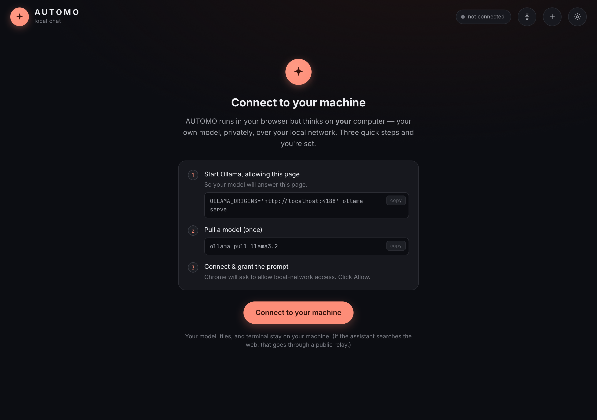

<div align="center">


# AUTOMO

**A local-first AI agent that lives in your browser and thinks on _your_ machine.**

A static web page that _is_ an agent: hosted UI, local everything else — your model, your files, your shell. Nothing leaves your machine.

[**▶ Launch AUTOMO**](https://damionrashford.github.io/lna/) · [Architecture](#-how-it-fits-together) · [Quickstart](#-quickstart) · [Develop](#-develop)

[](https://github.com/damionrashford/lna/actions/workflows/pages.yml)
[](https://github.com/damionrashford/lna/actions/workflows/e2e.yml)


<br/>



</div>

---

## What is this?

AUTOMO is a real **[`@openai/agents`](https://openai.github.io/openai-agents-js/) `SandboxAgent`** running _in the browser_ — not a reimplementation. A public HTTPS page, with one user-granted **[Local Network Access](https://wicg.github.io/local-network-access/)** (LNA) permission, reaches `localhost` to drive your own model, files, shell, and MCP tools.

> [!NOTE]
> **The one idea:** a public page can, with one permission, open a connection to `localhost`. AUTOMO uses that to talk to a local model _and_ drive a real Unix sandbox on your machine. **Hosted UI, local compute.**

Everything below the UI is yours and optional:

- **Model** — Ollama, vLLM, HuggingFace, **or a fully in-browser WebGPU engine** (transformers.js / MLC web-llm). Picked by a hardware-aware provider layer.
- **Sandbox** — shell + filesystem + `apply_patch`, running **either** on your machine via a tiny daemon **or** entirely in the page (Pyodide + just-bash + isomorphic-git). Bridge-optional.
- **Autonomy** — an opt-in loop that runs queued and scheduled tasks on their own, with a critic gate, loop detection, and cron recurrence.
- **Voice, MCP, PWA** — local voice mode (Whisper → model → Kokoro), MCP over three transports, and an installable offline app.

<sub>The repo is named `lna` for historical reasons — it began as a Local Network Access reference.</sub>

---

## 🚀 Quickstart

You need a Chromium browser (Chrome ≥142, or the flag on 138–141) and a local model. Three steps, on the machine you want AUTOMO to think on:

```bash
# 1 — let your model accept the page, and start it
OLLAMA_ORIGINS='https://damionrashford.github.io' ollama serve

# 2 — pull a model once (AUTOMO can also trigger this from the browser)
ollama pull llama3.2
```

3. Open [**AUTOMO**](https://damionrashford.github.io/lna/), click **Connect**, and grant Chrome's local-network prompt.

> [!TIP]
> No install at all? Switch **Settings → Sandbox** to _in-browser_ and pick a **WebGPU** model — you get shell, files, git, and inference entirely in the page, no Ollama, no daemon.

---

## 🧭 How it fits together

```
Browser (GitHub Pages, static)                    Your machine
┌────────────────────────────────┐                ┌──────────────────────────────┐
│ AUTOMO — React + Tailwind + RC  │                │ Ollama  /v1/responses         │
│  useChat (AI SDK UI)            │                │  (model, streaming)           │
│   └ LocalAgentTransport         │──── LNA ──────▶│                               │
│      run(SandboxAgent,{stream}) │                │ bridge (servers/bridge.ts)    │
│  BrowserSandboxClient ──────────┼──── LNA (WS) ─▶│  hosts UnixLocalSandboxClient  │
│   proxies every session call    │                │  → real shell, apply_patch,   │
└────────────────────────────────┘                │    materialize, snapshots     │
                                                   └──────────────────────────────┘
```

The chat surface is the **[Vercel AI SDK UI](https://ai-sdk.dev/docs/ai-sdk-ui)** (`useChat`), driven serverlessly by a `LocalAgentTransport` that runs the agent locally and translates its streamed run into a UIMessage stream. The sandbox is the SDK's own, behind two interchangeable backends.

---

## ✨ Capabilities

Everything here is real and wired into the agent. Expand a section for detail.

| Area | What you get |
| --- | --- |
| **Model providers** | Ollama · vLLM · HuggingFace · in-browser (transformers.js / web-llm) |
| **Sandbox backends** | Bridge (real machine) · in-browser (Pyodide, zero-install) |
| **Agent tools** | `web_search` · `read_url` · `update_plan` · `schedule_task` · `research` |
| **SDK capabilities** | shell · filesystem (`apply_patch` V4A) · skills · memory · compaction |
| **Autonomy** | durable task queue · scheduler · critic gate · loop-guard · cron |
| **MCP** | 3 transports · elicitation · roots · tasks — real `@modelcontextprotocol/sdk` |
| **Voice** | Whisper → same model → Kokoro, over a `RealtimeSession` |
| **Platform** | installable offline PWA · multi-tab locks · badging · background fetch |

<details>
<summary><b>Model — provider-aware, hardware-aware</b></summary>

<br/>

A provider layer (`@automo/inference`) fronts **Ollama, vLLM, HuggingFace, or a fully in-browser WebGPU engine** — `transformers.js` (ONNX) or **MLC web-llm** — both driving the agent through a custom SDK `Model` (`BrowserModel`).

Hardware detection (WebGPU adapter + a VRAM budget, `deviceMemory` / UA-CH / `oscpu` / WebGL renderer / WASM SIMD+threads / mobile / storage / battery) runs at idle and is **refined to exact RAM/VRAM/chip by the bridge's `/hw` probe**, then recommends a model size on Connect.

vLLM's native Responses transport enables native `apply_patch` + server-side compaction; Ollama / HuggingFace use a `ChatCompletions`-named shim (function-tool fallback). One resolver (`resolveBrainModel`) means **voice reuses the same model** — no second brain.

</details>

<details>
<summary><b>Sandbox — two interchangeable backends</b></summary>

<br/>

Behind the SDK's `SandboxClient` / `SandboxSession` / `Editor`:

1. **Bridge** — `BrowserSandboxClient` proxies every session call over a WebSocket to the SDK's `UnixLocalSandboxClient`: real processes, diffs, and snapshots on your machine.
2. **In-browser** — `InBrowserSandboxClient` runs it all in the page: `exec` via just-bash, filesystem CRUD via the Emscripten FS + the SDK's `applyDiff` (V4A), `materializeEntry(gitRepo)` via isomorphic-git, persist/hydrate via OPFS.

Selectable in Settings; the agent runs unchanged. In-browser is zero-install and sandboxed — it can't touch real host files or run native binaries.

</details>

<details>
<summary><b>Autonomy — an opt-in loop that works on its own</b></summary>

<br/>

Off by default. When enabled, AUTOMO runs queued and scheduled work through the _same_ agent and sandbox the chat uses:

- **Durable task queue** in IndexedDB (`runtime/autonomy/tasks.ts`) — goals, deps, retries, budgets, and a per-tab leader election so only one tab drives.
- **Precise scheduler** — a self-arming timer off each task's `runAfter` (not a blind poll), with a best-effort service-worker wake.
- **Cron recurrence** — `schedule_task` accepts a cron expression; recurring tasks re-arm on success.
- **Critic gate** — an LLM-as-judge **output guardrail** that fails a run when it doesn't meet the goal (a retry, not a crash).
- **Loop-guard** — a volatile-ID-stripped result fingerprint stops a task that keeps producing the same output.
- **Plan + subagents** — an `update_plan` tool the model maintains, and a read-only `research` subagent for fan-out without polluting the main context.

The queue speaks the **MCP Tasks protocol** — its status vocabulary matches the spec, it projects to MCP `Task` objects, and an in-page `automo-tasks` MCP server exposes `list` / `get` / `cancel`.

</details>

<details>
<summary><b>MCP, voice, human-in-the-loop, and the rest</b></summary>

<br/>

- **MCP** — the real `@modelcontextprotocol/sdk` client over **three transports**: Streamable HTTP, bridge-proxied stdio, and a **pure in-page stdio** transport (a bundled Node MCP server runs in the page over `node:*` browser shims — no bridge). Elicitation, roots, and tasks all supported; server-prefixed tool names.
- **Voice** — a `RealtimeSession` (`@openai/agents-realtime`) over a custom in-browser transport: Whisper (STT) → the same provider-aware model → Kokoro (TTS), with an AudioWorklet mic + energy VAD + barge-in, transcripts bridged into the chat.
- **Human-in-the-loop** — tools with `needsApproval` pause the run; the transport wraps pause → approve → resume in one streamed chat turn. MCP elicitation shares the surface.
- **Guardrails** — SDK agent + tool guardrails focused on credential safety (block pasted/leaked secrets, refuse to send secrets to web search, redact from tool output).
- **Persistence** — sessions as AI SDK `UIMessage`s in IndexedDB; the real sandbox workspace gzip-cached per session in OPFS, optionally mirrored to a granted folder on disk; client-side compaction for long chats.
- **PWA** — installable + offline: the service worker precaches the shell (same-origin GET only, so model/bridge/proxy traffic is untouched) and pre-downloads model weights via Background Fetch. Ships `share_target`, `file_handlers`, and `protocol_handlers`.

</details>

---

## 🔌 The bridge

The only local process — and it's **optional**. Chat, web search, the in-browser sandbox, WebGPU inference, in-page MCP, and voice all work without it. Run it when you want the _real_ machine: real files, native binaries, exact hardware sizing.

```bash
bun run bridge   # BRIDGE_TOKEN=dev bun servers/bridge.ts → 127.0.0.1:7967
```

One WebSocket on `127.0.0.1:7967` carries the **sandbox RPC** (hosts `UnixLocalSandboxClient`) and a **stdio pipe** (for stdio MCP servers), plus an HTTP `/hw` hardware probe.

> [!WARNING]
> The bridge spawns processes and runs a real shell — a public page reaching it is remote code execution. It's gated by an **HMAC-SHA256 nonce challenge** (the token is never sent in plaintext), a spawn allowlist, and binding to `127.0.0.1`. The sandbox `exec` is deliberately not allowlisted (it _is_ the agent's shell), so **the token is the whole perimeter** — keep it secret if you ever front it with a tunnel.

---

## 🛠 Develop

```bash
bun install                      # from repo root (Bun workspace)
bun run --cwd web dev            # Bun fullstack dev server (HMR)
bun run bridge                   # the sandbox host, in another terminal
bun run --cwd web build          # React Compiler + Tailwind → static web/dist
```

`web/` is React + Tailwind, compiled by the **React Compiler** and bundled by `bun build` to static assets. The build ([`web/scripts/build.ts`](web/scripts/build.ts)) injects the SEO `<head>` + service worker, copies `public/`, aliases `node:*` → the in-page MCP shims, generates the lazy-skills index, and **conditionally externalizes** the heavy in-browser deps that aren't installed — so the bundle stays green either way.

> [!IMPORTANT]
> `@openai/agents/sandbox/local` (`UnixLocalSandboxClient`) is **Node-only** — imported _only_ in `servers/bridge.ts`, never in the browser bundle.

**Bun workspace:** `web/` (the agent) · `servers/` (the bridge) · `inference/` (`@automo/inference`).

---

## 🧪 Testing

| Suite | Covers | Run |
| --- | --- | --- |
| **Unit** (22, `bun:test`) | JSON repair · loop-guard · cron · MCP-task projection | `bun run --cwd web test` |
| **E2E** (Playwright ×3 browsers) | gate + clip regression · layout · onboarding · connected app (mocked) | `bun run --cwd web test:e2e` |
| **Smoke** | in-browser sql.js / MCP / Pyodide / embeddings | `bun run --cwd web smoke:build` |
| **Visual** | `Bun.WebView` screenshots (WKWebView, zero-dep) | `bun run --cwd web smoke:visual` |

E2E runs on **chromium, mobile-chrome, and webkit** against the real production bundle (built and served by `tests/preview.ts`). New tests are auto-discovered — drop a `*.test.ts` in `tests/unit/` or a `*.spec.ts` in `tests/e2e/` and it runs locally and in CI. See [`web/tests/README.md`](web/tests/README.md).

> What can't be tested headless — voice, the Pyodide sandbox, WebGPU inference, real inference over LNA — is covered by the smoke harness or verified manually.

---

## 🚢 Deploy

Push to `main` under `web/**` → [`pages.yml`](.github/workflows/pages.yml) runs `bun install && bun run build` and publishes `web/dist` to Pages. The site URL is **derived, not hardcoded** — from `public/CNAME` (custom domain), else the repo (`GITHUB_REPOSITORY` / git remote), with `SITE_ORIGIN` / `PUBLIC_PATH` overrides — so canonical / OG / sitemap / manifest paths regenerate automatically. A custom domain is just a `public/CNAME` file.

---

## 📚 Sources

- [WICG Local Network Access spec](https://wicg.github.io/local-network-access/) · [Chrome LNA permission](https://developer.chrome.com/blog/local-network-access) · [MDN: Local network access](https://developer.mozilla.org/en-US/docs/Web/Security/Defenses/Local_network_access)
- [OpenAI Agents JS](https://openai.github.io/openai-agents-js/) · [Vercel AI SDK UI](https://ai-sdk.dev/docs/ai-sdk-ui) · [Model Context Protocol](https://modelcontextprotocol.io)

<sub>Unofficial. Not affiliated with Google, Mozilla, OpenAI, or Vercel.</sub>
